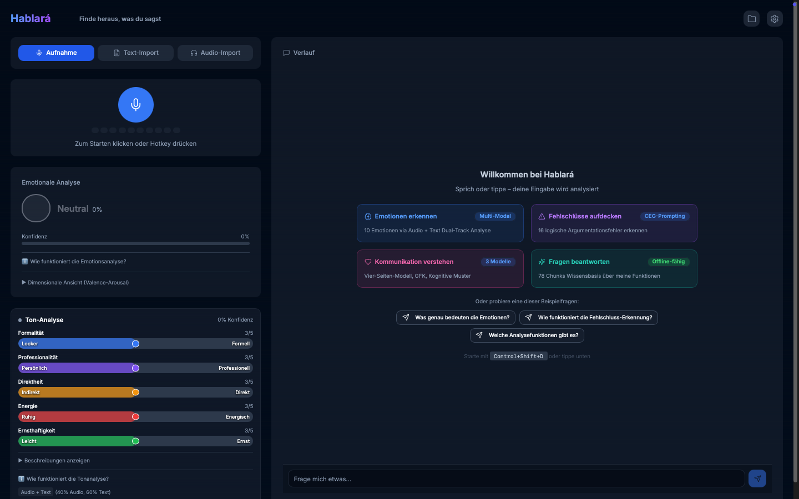

# Hablará – „Er/sie wird sprechen"

> **Finde heraus, was du sagst**

[](https://opensource.org/licenses/MIT)
[][releases]
[][releases]
[](https://tauri.app/)
[](https://github.com/fidpa/homebrew-hablara)

Desktop-App für Selbstreflexion mit Spracherkennung und KI-gestützter Sprachanalyse.

Transkription erfolgt lokal (whisper.cpp).

Sprachanalyse wahlweise lokal (Ollama) oder via Cloud (OpenAI/Anthropic).



## Inhalt

- [Plattformen](#plattformen)
- [Installation](#installation)
- [Funktionen](#funktionen)
- [Architektur](#architektur)
- [Datenschutz](#datenschutz)
- [Vergleich](#vergleich)
- [Mitwirken](#mitwirken)
- [Lizenz](#lizenz)

---

## Plattformen

| Plattform | Status | Architektur | Hinweise |
|----------|--------|--------------|-------|
| **macOS** | ✅ Verfügbar | ARM64 (Apple Silicon) | MLX-Whisper verfügbar |
| **macOS** | ✅ Verfügbar | x86_64 (Intel) | Nur whisper.cpp |
| **Windows** | ✅ Verfügbar | x86_64 | whisper.cpp CPU, kein MLX, WASAPI Audio |
| **Linux** | ✅ Verfügbar | x86_64 | Ubuntu 20.04+, .deb/.rpm/.AppImage |

> **Hinweis:** macOS (ARM64) ist die primäre Entwicklungsplattform.

### Feature-Verfügbarkeit nach Plattform

| Feature | macOS ARM64 | macOS x64 | Windows x64 | Linux x64 |
|---------|-------------|-----------|-------------|-----------|
| whisper.cpp | ✅ | ✅ | ✅ | ✅ |
| MLX-Whisper | ✅ | ❌ | ❌ | ❌ |
| Ollama LLM | ✅ | ✅ | ✅ | ✅ |
| OpenAI/Anthropic | ✅ | ✅ | ✅ | ✅ |
| Global Hotkey | ✅ | ✅ | ✅ | ✅ |
| Native Audio | CoreAudio | CoreAudio | WASAPI | ALSA/PipeWire |
| API Key Storage | Keychain | Keychain | Credential Manager | Secret Service |

---

## Installation

**Hinweis:** Ohne LLM-Anbieter funktioniert nur die Transkription. Alle psychologischen Features benötigen Ollama, OpenAI oder Anthropic.

---

###  Installation

**Voraussetzungen:** macOS 10.15+ · 10 GB freier Speicher

**Download:** [GitHub Releases][releases] – Universal DMG (~1.3 GB) | Apple Silicon DMG (~1.2 GB)

#### 1️⃣ Hablará installieren
- DMG öffnen → `Hablará.app` in `Programme` ziehen
- Sicherheitseinstellungen: "Trotzdem öffnen" (einmalig)

<details>
<summary>📋 Alternative: via Homebrew</summary>

```bash
brew install --cask fidpa/hablara/hablara
```

Updates: `brew upgrade --cask hablara`

</details>

#### 2️⃣ Ollama + Sprachmodell installieren (empfohlen)

```bash
curl -fsSL https://raw.githubusercontent.com/fidpa/hablara/main/scripts/setup-ollama-mac.sh | bash
```

<details>
<summary>📋 Was macht dieser Befehl?</summary>

1. Installiert Ollama (falls nicht vorhanden)
2. Lädt qwen2.5:7b Modell (~4.7 GB)
3. Erstellt optimiertes Custom-Modell
4. Verifiziert Installation

</details>

---

###  Installation

**Voraussetzungen:** Ubuntu 20.04+ / Debian 11+ / Fedora 36+ · x64 · 10 GB freier Speicher

**Download:** [GitHub Releases][releases] – .deb (Debian/Ubuntu) | .rpm (Fedora/RHEL) | .AppImage (Universal)

#### 1️⃣ Hablará installieren
- Paket herunterladen (.deb, .rpm oder .AppImage)
- Mit Paketmanager installieren oder AppImage direkt ausführen

<details>
<summary>📋 Installations-Befehle nach Distribution</summary>

**Debian/Ubuntu (.deb):**
```bash
sudo dpkg -i hablara_1.1.1_amd64.deb
sudo apt-get install -f  # Falls Abhängigkeiten fehlen
```

**Fedora/RHEL (.rpm):**
```bash
sudo rpm -i hablara-1.1.1-1.x86_64.rpm
# oder: sudo dnf install hablara-1.1.1-1.x86_64.rpm
```

**AppImage (Universal, keine Installation nötig):**
```bash
chmod +x hablara_1.1.1_amd64.AppImage
./hablara_1.1.1_amd64.AppImage
```

AppImages können mit [AppImageLauncher](https://github.com/TheAssassin/AppImageLauncher) ins Anwendungsmenü integriert werden.

</details>

#### 2️⃣ Ollama + Sprachmodell installieren (empfohlen)

```bash
curl -fsSL https://raw.githubusercontent.com/fidpa/hablara/main/scripts/setup-ollama-linux.sh | bash
```

<details>
<summary>📋 Was macht dieser Befehl?</summary>

1. Installiert Ollama (falls nicht vorhanden)
2. Lädt qwen2.5:7b Modell (~4.7 GB)
3. Erstellt optimiertes Custom-Modell
4. Verifiziert Installation

</details>

#### 3️⃣ API Key Speicherung (OpenAI/Anthropic)

**Cloud-Provider (OpenAI/Anthropic) benötigen einen Schlüsselbund-Dienst:**

<details>
<summary>📋 Benötigte Pakete nach Desktop-Umgebung</summary>

**GNOME (Standard bei Ubuntu, Fedora, Debian):**
```bash
# Meist bereits installiert
sudo apt install gnome-keyring  # Debian/Ubuntu
sudo dnf install gnome-keyring  # Fedora/RHEL
```

**KDE Plasma 6 (2024+):**
```bash
sudo apt install kwalletmanager  # Debian/Ubuntu
sudo dnf install kwalletmanager  # Fedora/RHEL
# Plasma 6 nutzt ksecretd (Secret Service native, voll kompatibel)
```

**KDE Plasma 5 (älter):**
```bash
sudo apt install kwalletmanager  # Debian/Ubuntu
sudo dnf install kwalletmanager  # Fedora/RHEL
# Plasma 5 benötigt Secret Service Bridge-Aktivierung in KWallet-Einstellungen
```

**Minimal Window Managers (i3, bspwm, etc.):**
```bash
# Manuelle Installation von GNOME Keyring (auch ohne GNOME Desktop)
sudo apt install gnome-keyring libsecret-1-0  # Debian/Ubuntu
sudo dnf install gnome-keyring libsecret      # Fedora/RHEL

# Daemon manuell starten (falls nicht automatisch):
eval $(gnome-keyring-daemon --start --components=secrets)
```

**KeePassXC (Alternative für alle Desktop-Umgebungen):**
```bash
sudo apt install keepassxc  # Debian/Ubuntu
sudo dnf install keepassxc  # Fedora/RHEL
# KeePassXC → Einstellungen → Secret Service Integration aktivieren
```

</details>

**⚠️ Hinweis für Flatpak/Snap:**
- Direct Distribution: .deb/.rpm/.AppImage funktionieren Out-of-the-Box
- Flatpak/Snap: API Keys können in v1.0.x NICHT sicher gespeichert werden (XDG Portal Secret API fehlt)
- **Workaround:** Ollama (lokal) nutzen oder auf Direct Distribution umsteigen

**Troubleshooting:**
- Fehler "Kein Schlüsselbund-Dienst gefunden" → Paket installieren (siehe oben)
- Fehler "Schlüsselbund antwortet nicht" → Daemon starten: `gnome-keyring-daemon --start`
- KDE: Secret Service in KWallet aktivieren: `systemsettings5` → Wallet → "Enable Secret Service"

---

###  Installation

**Voraussetzungen:** Windows 10/11 (x64) · 10 GB freier Speicher

**Download:** [GitHub Releases][releases] – NSIS Installer (~1.1 GB, empfohlen) | MSI (~1.2 GB)

#### 1️⃣ Hablará installieren
- `.exe` oder `.msi` herunterladen und ausführen
- Windows Defender SmartScreen: "Weitere Informationen" → "Trotzdem ausführen"
  _(App ist nicht signiert)_

#### 2️⃣ Ollama + Sprachmodell installieren (empfohlen)

**Einmalige Vorbereitung:**
```powershell
Set-ExecutionPolicy -ExecutionPolicy RemoteSigned -Scope CurrentUser
```

**Setup-Skript ausführen:**
```powershell
Invoke-WebRequest -Uri "https://raw.githubusercontent.com/fidpa/hablara/main/scripts/setup-ollama-win.ps1" -OutFile "$env:TEMP\setup-ollama-win.ps1"; & "$env:TEMP\setup-ollama-win.ps1"
```

<details>
<summary>📋 Was macht dieser Befehl?</summary>

1. Installiert Ollama via winget (falls nicht vorhanden)
2. Lädt qwen2.5:7b Modell (~4.7 GB)
3. Erstellt optimiertes Custom-Modell
4. Verifiziert Installation

</details>

---

<details>
<summary>Alternative: Cloud-LLM (OpenAI/Anthropic)</summary>

1. **Hablará öffnen** → Einstellungen (Zahnrad-Icon) → KI-Modelle
2. **Anbieter wählen**: OpenAI oder Anthropic
3. **API Key eingeben**:
   - OpenAI: [platform.openai.com/api-keys](https://platform.openai.com/api-keys)
   - Anthropic: [console.anthropic.com/settings/keys](https://console.anthropic.com/settings/keys)

Cloud-LLM erfordert DSGVO-Einwilligung (wird beim ersten Start abgefragt)

</details>

---

## Funktionen

- **Hotkey-Aktivierung** – Starte die Aufnahme mit Ctrl+Shift+D aus jeder Anwendung
- **Native Audio-Aufnahme** – Professionelle Audioqualität für präzise Transkription (cpal @ 16kHz)
- **Lokale Transkription** – Audio-Daten bleiben auf dem Gerät
- **LED-Pegelanzeige** – 10-Segment Visualisierung während der Aufnahme (6 grün/2 orange/2 rot)

**AI-Enrichment (7 psychologisch-fundierte Analysen):**

| Analyse | Framework | Output |
|---------|-----------|--------|
| **Emotionserkennung** | Plutchik, Russell | 10 Emotionstypen, Dual-Track (Audio 40% + Text 60%) |
| **Argumentationsfehler** | CEG-Prompting | 16 Fehlschluss-Typen erkennen |
| **GFK-Analyse** | Rosenberg | Beobachtungen, Gefühle, Bedürfnisse, Bitten |
| **Kognitive Verzerrungen** | Beck (CBT) | 7 Denkmuster + Reframe-Vorschläge |
| **Vier-Seiten-Modell** | Schulz von Thun | Sachinhalt, Selbstoffenbarung, Beziehung, Appell |
| **Tonalität** | Sprechweise-Analyse | Formell/Informell, Bestimmt/Zurückhaltend |
| **Topic-Klassifizierung** | 7 Kategorien | Arbeit, Gesundheit, Beziehungen, etc. |

- **RAG-Wissensassistent** – Beantwortet zuverlässig Fragen (Kontext über letzte 3 Nachrichten per React State). Intelligente Abkürzungserkennung für psychologische Fachbegriffe (GFK, CBT, VAD)


<details>
<summary><b>Psychologische Frameworks im Detail</b></summary>

**GFK (Gewaltfreie Kommunikation – Marshall Rosenberg):**
- 6 Bereiche: Beobachtungen, Gefühle, Bedürfnisse, Bitten, GFK-Übersetzung, Reflexionsfrage
- Ziel: Kommunikations-Awareness, Bedürfnis-Erkennung

**Kognitive Verzerrungen (CBT – Aaron Beck):**
- 7 Typen: Katastrophisieren, Schwarz-Weiß-Denken, Übergeneralisierung, Gedankenlesen, Personalisierung, Emotionales Schlussfolgern, Sollte-Aussagen
- Output: Thinking Style Badge (Ausgewogen/Leicht verzerrt/Stark verzerrt) + Reframe-Vorschläge

**Vier-Seiten-Modell (Schulz von Thun):**
- 4 Quadranten: Sachinhalt (blau), Selbstoffenbarung (lila), Beziehung (pink), Appell (orange)
- Output: Potenzielle Missverständnisse + Kommunikations-Tipps

**Wichtig:** Alle Features dienen der **Selbstreflexion**, nicht der klinischen Diagnostik. KI-Accuracy-Disclaimer (EU AI Act Art. 52) in Tour und About-Section. Krisenhotline: Telefonseelsorge 0800 111 0 111 (24/7, kostenlos).

</details>

**Technisch:**
- **Flexible LLM-Wahl** – Ollama (lokal/kostenlos), OpenAI, oder Anthropic Claude
- **Persistente Speicherung** – Alle Aufnahmen mit Metadaten automatisch gespeichert
- **Chat-Export** – 5 Formate (Markdown/TXT/PDF/HTML/DOCX) mit Export aller Metadaten
- **PDF Export** – Einzelne Aufnahmen als PDF exportieren (10 Sektionen: Transkript + alle Analysen)
- **Sichere API Key Speicherung** – OS-native Verschlüsselung (Keychain/Credential Manager/Secret Service)
- **Bundle-Size-Optimierung** – INT8-Quantization (-75% Model Size)
- **Window State Persistence** – Position und Größe werden automatisch gespeichert
- **Robustheit** – 4 Error Boundaries isolieren Fehler auf Komponentenebene (Chat-Crash ≠ App-Crash)

<details>
<summary><b>Beispiel-Workflow</b> – Demo einer typischen Analyse</summary>

**Beispiel 1:**
```text
"Das Gespräch mit Lisa hat mir gut getan.
Sie hat einen Punkt angesprochen, den ich so nicht gesehen hatte.
Ich werde das morgen anders angehen."
```

| Analyse | Ergebnis |
|---------|----------|
| **Emotion** | Ruhe (78% Confidence) – Stabile Stimmlage, moderate Speech Rate |
| **GFK** | Bedürfnis nach Verständnis und Verbindung erkannt |
| **Selbstreflexion** | Offenheit für neue Perspektiven, konstruktive Haltung |

**Beispiel 2:**
```text
"Nach dem Spaziergang bin ich viel klarer.
Die frische Luft hat geholfen, die Gedanken zu sortieren.
Jetzt weiß ich, wie ich das angehen will."
```

| Analyse | Ergebnis |
|---------|----------|
| **Emotion** | Klarheit/Zuversicht (82% Confidence) – Ruhiger Tonfall |
| **Vier-Seiten** | Selbstoffenbarung: Reflexion über eigene Strategien |
| **Selbstreflexion** | Erkenntnis über wirksame Bewältigungsmethoden |

</details>

**Hinweise:**
- **Verarbeitungsdauer** hängt ab von: Aufnahmelänge, Analyseebenen, Hardware, LLM-Anbieter
- **KI-Ergebnisse** dienen der Selbstreflexion und können fehlerhaft sein

---

<details>
<summary><b>Technische Details</b> – Emotionserkennung, Security, Implementierung</summary>

### Emotionserkennung

**Dual-Track Emotions-Erkennung**:
- **Audio-Track (40%)**: 12 Features (Prosodisch + Spektral)
  - 3 Basis: Tonhöhe, Energie, Sprechrate
  - 5 Prosodisch: Tonhöhe-Varianz/-Bereich, Energie-Varianz, Pausendauer/-häufigkeit
  - 4 Spektral: ZCR, Spectral Centroid/Rolloff/Flux
- **Text-Track (60%)**: LLM-Semantik (Ollama/OpenAI/Anthropic)
- **Fusion**: Gewichteter Durchschnitt + 15% Confidence-Boost bei Übereinstimmung

**Methodik**: Dual-Track Fusion (Audio 40% + Text 60%, Poria et al. 2017) mit Confidence-Boosting

**Differenzierung**:
- Stress vs. Aufregung: Tonhöhe-Varianz (unstetig vs. stetig)
- Aggression vs. Überzeugung: Spectral Flux (abrupt vs. fließend)

**Wissenschaftliche Quellen**: Plutchik (1980), Russell (1980), PAD Model, IEMOCAP Dataset

### Implementierung

**Performance**:
- **Audio-Analyse**: Rust-native (12 Features)
- **LLM Enrichment**: Parallel-Processing für minimale Latenz
- **Bundle Size**: 2 ONNX-Modelle (VAD 1.8 MB + Embedding 118 MB), Embedding INT8-quantisiert (-75%)

**Robustheit**:
- **spawn_blocking Pattern**: Non-blocking I/O für Storage (verhindert 500-Errors)
- **Memory Leak Prevention**: Named EventListeners + Cleanup (AudioPlayer gefixt)
- **ML Engineering**: Self-quantized ONNX model (FP32→INT8, 75% Reduktion, <2% Accuracy-Loss)
- **Safety Guardrails**: 7-Pattern LLM Output Filter (Defense-in-Depth) verhindert klinische Aussagen (ICD-10, Dosierungen). Keine Diagnosen, Arztvorbehalt gewahrt

**Code-Qualität**:
- TypeScript strict mode, Rust mit serde
- <400 Zeilen pro Datei (SOLID, SRP)
- Immutability-Patterns (kein `obj.prop = value`)

### Tastenkürzel & Accessibility

- `Ctrl+Shift+D` – Aufnahme starten/stoppen (global)
- `Tab` / `Shift+Tab` – Navigation
- `Ctrl+Enter` – Text absenden
- WCAG 2.1 AA konform, Screen-Reader-kompatibel

</details>

<details>
<summary><b>Design-Entscheidungen</b> – Warum Tauri, Native Audio, Ollama?</summary>

*Architektur-Diagramm: Siehe [Architektur](#architektur) unten.*

#### Architektur

**Warum Tauri 2.0 statt Electron?**
- Native Rust-Integration für lokale ML-Modelle (whisper.cpp, ONNX) ohne FFI-Overhead
- Geringerer RAM-Verbrauch – wichtig bei parallelem Ollama + Whisper + Embedding
- Schnellerer Startup (~200ms vs. ~800ms), integrierte Security-Sandbox

**Warum Native Audio (cpal) statt Web Audio API?**
- Browser ignoriert 16kHz Request (liefert 48kHz). VAD: 0% vs. >90% mit cpal
- FFT-Resampling (rubato) garantiert Whisper-kompatible Sample-Rate

**Warum Next.js 14 + React 18 pinned (nicht 15/19)?**
- Tauri 2.0 Kompatibilität – neuere Versionen brechen Build
- Bewusste Stabilität vor "Bleeding Edge"

#### AI/ML Pipeline

**Warum Silero VAD vor Whisper?**
- Whisper halluziniert bei Stille ("Danke fürs Zuschauen!", Musik-Notationen)
- VAD filtert Nicht-Sprache vor Transkription → 0% False Positives
- 1.8 MB ONNX, <1ms Latenz, threshold-basiert (0.3)

**Warum whisper.cpp (lokal) statt Cloud-STT?**
- 100% Privacy, kostenlos, schnelle lokale Inferenz

**Warum Dual-Track Emotion (Audio 40% + Text 60%)?**
- Single-Track limitiert (nur Audio ODER Text), Dual-Track Fusion deutlich robuster
- Audio erkennt Sarkasmus (Prosody), Text erkennt Semantik

**Warum 12 Audio Features statt 3?**
- Erweitert von 3 auf 12 Features (inkl. Prosodic/Spectral)
- Differenziert: Stress/Aufregung (Tonhöhe-Varianz), Aggression/Überzeugung (Spectral Flux)

**Warum Ollama als Standard-LLM?**
- Privacy-First, kostenlos, 2-Command Setup, Persistent RAM (kein Cold-Start)

**Warum Qwen 2.5 als Modell?**
- **Mehrsprachig trainiert:** Inkl. Deutsch
- **Balanced Size:** 7B Parameter bietet einen guten Kompromiss zwischen Qualität und Latenz
- **JSON Compliance:** Zuverlässige strukturierte Outputs für unsere Prompt-Architektur
- **Angepasstes Modelfile:** Reduzierter Context (8K statt 32K) für beschleunigte Inferenz, Temperature 0.3 für konsistente Outputs

**Warum Multi-Anbieter LLM?**
- Wahlfreiheit: Privacy (Ollama) vs. Geschwindigkeit (OpenAI) vs. Qualität (Anthropic), kein Vendor Lock-in

**Warum RAG-Chatbot (78 Chunks)?**
- Ohne RAG halluziniert das LLM – mit RAG: hohe Zuverlässigkeit
- Kontextbasierte Antworten reduzieren Halluzinationen deutlich

**Warum INT8-quantisiertes Embedding (118 MB statt 448 MB)?**
- 74.9% Größenreduktion bei <2% Accuracy-Verlust (0.990 similarity)
- Self-quantized für Bundle-Optimierung

#### Security & Privacy

**Warum Keychain / Credential Manager / Secret Service statt localStorage?**
- localStorage: XSS-anfällig, Klartext auf Disk
- OS-native: AES-256-GCM (macOS Keychain), DPAPI (Windows), D-Bus Secret Service (Linux), Zero Plaintext

**Warum DSGVO Art. 6 statt Art. 9?**
- Art. 9 erfordert DPIA + MDR-Zertifizierung (~50.000 EUR) – unverhältnismäßig für Selbstreflexions-Tool

**Warum KI-Accuracy-Disclaimer (EU AI Act Art. 52)?**
- Transparenzpflicht: "KI-Ergebnisse können fehlerhaft sein"
- 4-Stufen-Strategie: Tour, About-Section, Confidence-Tooltips, Krisenhotline

#### UX-Entscheidungen

**Warum 4 Error Boundaries statt globaler Fehlerbehandlung?**
- Komponenten-Isolation: Chat-Crash ≠ App-Crash
- "Fail Small, Recover Fast" – nur betroffene Komponente zeigt Fehler

</details>

<details>
<summary><b>Entwicklungsumgebung</b> – Voraussetzungen, Installation, Build</summary>

### Voraussetzungen

- **Node.js** >= 18
- **Rust** >= 1.70
- **pnpm** (oder npm)
- **Ollama** (optional, für lokales LLM)
- **Git LFS** (erforderlich für ONNX-Modelle)

### 1. Repository clonen mit Git LFS

**Wichtig:** Hablará nutzt Git LFS für große Modelle (Whisper 1.6 GB + Embedding 118 MB).

```bash
# Git LFS installieren (einmalig)
# macOS:
brew install git-lfs

# Windows:
winget install Git.LFS
# oder: https://git-lfs.com → Installer

git lfs install

# Repository clonen (LFS-Dateien werden automatisch heruntergeladen)
git clone https://github.com/fidpa/hablara.git
cd hablara

# Verifizieren: Embedding-Modell sollte ~118 MB groß sein
# macOS/Linux:
ls -lh public/models/onnx-models/paraphrase-multilingual-MiniLM-L12-v2-onnx/onnx/model_quantized.onnx
# Windows (PowerShell):
# Get-Item public\models\onnx-models\paraphrase-multilingual-MiniLM-L12-v2-onnx\onnx\model_quantized.onnx | Select-Object Length
```

**Ohne Git LFS:** RAG-Feature (Chatbot) funktioniert nicht (kein Embedding-Modell verfügbar).

**Troubleshooting:** Falls das Modell nur wenige KB groß ist (LFS-Pointer statt Binärdatei):
```bash
git lfs pull  # LFS-Dateien manuell herunterladen
```

### 2. Dependencies installieren

```bash
pnpm install
```

### 3. Whisper Model herunterladen (optional)

```bash
# Erstelle Verzeichnisse
# macOS/Linux:
mkdir -p src-tauri/binaries src-tauri/models
# Windows (PowerShell):
# New-Item -ItemType Directory -Force -Path src-tauri\binaries, src-tauri\models

# whisper.cpp binary kompilieren (oder herunterladen)
# Siehe: https://github.com/ggerganov/whisper.cpp

# Model herunterladen (german-turbo empfohlen)
# macOS/Linux:
curl -L -o src-tauri/models/ggml-model.bin \
  https://huggingface.co/cstr/whisper-large-v3-turbo-german-ggml/resolve/main/ggml-model.bin
# Windows (PowerShell):
# Invoke-WebRequest -Uri "https://huggingface.co/cstr/whisper-large-v3-turbo-german-ggml/resolve/main/ggml-model.bin" -OutFile "src-tauri\models\ggml-model.bin"
```

### 4. Ollama einrichten (empfohlen für lokale KI)

**Ollama ist der empfohlene LLM-Anbieter** für optimale Performance (persistent server).

**Bereits installiert?** Prüfen mit:
```bash
ollama --version  # Falls installiert: Springe zu Schritt 2
```

**Schritt 1: Ollama installieren**

```bash
# macOS: brew install ollama
# Windows: winget install Ollama.Ollama
# Oder: https://ollama.ai/download
```

**Schritt 2: Basis-Modell herunterladen** (4.7 GB, einmalig)
```bash
ollama pull qwen2.5:7b
```

**Schritt 3: Hablará-optimiertes Modell erstellen**
```bash
ollama create qwen2.5:7b-custom -f scripts/ollama/qwen2.5-7b-custom.modelfile
```

**LLM-Anbieter Alternativen:**
- **MLX-LLM** (Optional, Power-User): 3x schneller, manuelles Setup erforderlich
- **OpenAI/Anthropic API**: API Key in Einstellungen konfigurieren

### 5. Development starten

```bash
pnpm run dev:safe
```

### Build

```bash
# App erstellen (alle Plattformen)
pnpm tauri build
```

| Plattform | Output |
|-----------|--------|
| macOS | `src-tauri/target/release/bundle/dmg/` |
| Windows | `src-tauri/target/release/bundle/nsis/` und `msi/` |
| Linux | `src-tauri/target/release/bundle/deb/`, `rpm/` und `appimage/` |

</details>

<details>
<summary><b>LLM-Anbieter</b> – Ollama, OpenAI, Anthropic</summary>

Hablará unterstützt drei LLM-Anbieter:

| Anbieter | Vorteile | Setup-Aufwand | Kosten | DSGVO | Empfehlung |
|----------|----------|---------------|--------|-------|------------|
| **Ollama** | 100% lokal, keine API-Keys | Niedrig | Kostenlos | Konform | **Standard** |
| **OpenAI** | Schnellste Antworten, GPT-4o | Sehr niedrig | Pay-per-Use | Cloud | Bei Bedarf |
| **Anthropic** | Claude Sonnet, thoughtful | Sehr niedrig | Pay-per-Use | Cloud | Bei Bedarf |

</details>

<details>
<summary><b>FAQ</b> – Häufige Fragen</summary>

### Kann ich es ohne Ollama testen?
**Ja**, mit OpenAI/Anthropic API-Key (Cloud-basiert).

### Funktioniert es auf Windows/Linux?
**Windows:** Ja, vollständig unterstützt (x64, whisper.cpp CPU). Download im [GitHub Releases][releases].
**Linux:** Ja, vollständig unterstützt (x64, Ubuntu 20.04+). Download: .deb, .rpm oder .AppImage im [GitHub Releases][releases].

### Wie groß ist das Ollama-Model?
**~4.7 GB** (qwen2.5:7b). Leistungsstärkere Alternative: qwen2.5:14b (~9 GB).

### Wo speichert Hablará Daten?

**macOS:**
```
~/Library/Application Support/Hablara/recordings/
```

**Linux:**
```
~/.local/share/hablara/recordings/
```
(XDG_DATA_HOME Standard)

**Windows:**
```
%LOCALAPPDATA%\Hablara\recordings\
```

**Migration:** Ab v1.0.4 werden alte Aufnahmen aus `~/Hablara/recordings/` automatisch an die neuen Speicherorte migriert.

**Details:** Siehe [STORAGE.md](docs/guides/STORAGE.md)

### Was ist der Unterschied zwischen App Store und Direct Distribution?

| Feature | Direct (GitHub) | App Store |
|---------|-----------------|-----------|
| **Hotkey** | ✅ `Ctrl+Shift+D` | ❌ Nicht verfügbar |
| **Ollama Setup** | Terminal-Befehl | App oder Cloud-API |
| **Speicherort** | `Application Support/` | `Documents/` |
| **Updates** | Manuell | Automatisch |

**Empfehlung:** Direct Distribution für volle Feature-Unterstützung (Global Hotkeys).

### Kann ich alte Aufnahmen ansehen und deren Analysen exportieren?
**Ja** – Folder-Icon in der Kopfzeile → Aufnahmen-Verzeichnis öffnet sich.

### Kann ich den Chat-Verlauf exportieren?
**Ja** – 5 Export-Formate verfügbar:
- **Markdown (.md)** – YAML Frontmatter + Full Metadata (GFK, Cognitive, FourSides)
- **Plain Text (.txt)** – ASCII Art Separators, simplified Metadata
- **PDF** – Via jsPDF, Print-optimized Styling
- **HTML** – Fallback für Popup-Blocker
- **Word (.docx)** – Rich Formatting mit Farben, professionelle Dokumente

**Export-Button** in der Chat-Ansicht (neben RAG-Chatbot). Alle Metadaten (Emotion, Fallacies, Audio Features) werden inkludiert, wenn aktiviert.

### Wie kann ich zwischen LLM-Anbietern wechseln?
**Einstellungen → KI-Modelle** – Ollama/OpenAI/Anthropic mit einem Klick wählbar.

</details>

---

## Architektur

```
┌─────────────────────────────────────────────────────────────────┐
│                    Hablará Desktop App                          │
│  ┌───────────────────────────────────────────────────────────┐  │
│  │  Frontend (Next.js 14 + React 18)                         │  │
│  │  • UI Components (Audio Recorder, Emotion Indicator)      │  │
│  │  • State Management (React Hooks)                         │  │
│  │  • Hotkey Listener (Ctrl+Shift+D)                         │  │
│  │  • RAG (ONNX 118 MB + SQLite FTS5)                        │  │
│  └───────────────────────────────────────────────────────────┘  │
│                           │ IPC (Tauri Commands)                │
│  ┌───────────────────────────────────────────────────────────┐  │
│  │  Rust Backend (Tauri 2.0)                                 │  │
│  │  • Native Audio (cpal @ 16kHz)                            │  │
│  │  • Silero VAD (ONNX, 1.8 MB)                              │  │
│  │  • Audio Analysis (12 Features)                           │  │
│  │  • Storage Manager (JSON Dateien)                         │  │
│  │  • whisper.cpp Integration (Sidecar)                      │  │
│  │  • API Key Security (native Keystores)                    │  │
│  └───────────────────────────────────────────────────────────┘  │
└─────────────────────────────────────────────────────────────────┘
```

### Verarbeitungs-Pipeline

```
Aufnahme → VAD → whisper.cpp → LLM-Analyse → Speicherung → UI
   │        │         │             │             │          │
   ▼        ▼         ▼             ▼             ▼          ▼
Hotkey   Silero    Transkription  Dual-Track   Auto-Save   Ergebnis
(Ctrl+   filtert   (lokal)        Emotion +    (lokal)     anzeigen
Shift+D) Stille                   Fehlschluss
                                  (parallel)
```

### KI-Modelle

```
┌─────────────────────────────────────────────────────────────────┐
│   Audio-Pipeline                     RAG-Wissensassistent       │
│                                                                 │
│   Audio-Eingang                      User-Frage                 │
│        │                                  │                     │
│        ▼                                  ▼                     │
│   ┌────────────────────┐            ┌────────────────────┐      │
│   │ Silero VAD (1.8 MB)│            │ Embedding (118 MB) │      │
│   │ filtert Stille     │            │ Semantische Suche  │      │
│   └────────────────────┘            └────────────────────┘      │
│        │                                  │                     │
│        ▼                                  ▼                     │
│   ┌────────────────────┐            ┌────────────────────┐      │
│   │ whisper.cpp (1.6GB)│            │ SQLite FTS5        │      │
│   │ Speech-to-Text     │            │ 78 Wissens-Chunks  │      │
│   └────────────────────┘            └────────────────────┘      │
│        │                                  │                     │
│        └───────────────┬──────────────────┘                     │
│                        ▼                                        │
│   ┌──────────────────────────────────────────────────────────┐  │
│   │ LLMs (Multi-Provider, frei wählbar via Einstellungen)    │  │
│   │ • Ollama (lokal, 2-4s, gratis, Datenschutz)              │  │
│   │ • OpenAI (Cloud, 0.5-2s, günstig, Geschwindigkeit)       │  │
│   │ • Anthropic (Cloud, 0.5-2s, teurer, Qualität)            │  │
│   └──────────────────────────────────────────────────────────┘  │
│        │                                  │                     │
│        ▼                                  ▼                     │
│   7 Analysen                         Chat-Antwort               │
│   (Emotion, GFK, etc.)               (kontextbasiert)           │
└─────────────────────────────────────────────────────────────────┘
```

### Tech-Stack (3-Tier Architektur)

| Layer | Technologie | Zweck |
|-------|-------------|-------|
| **Frontend** | Next.js 14, React 18, TailwindCSS | UI, State Management |
| **Desktop** | Tauri 2.0, Rust 1.70+ | Native Audio, IPC, Storage |
| **AI/ML** | whisper.cpp (german-turbo), Ollama (qwen2.5:7b) | STT, LLM Enrichment |
| **VAD** | Silero VAD v4 (ONNX, 1.8 MB) | Voice Activity Detection |
| **Embedding** | paraphrase-multilingual-MiniLM-L12-v2 (ONNX INT8, 118 MB) | RAG Semantic Search |
| **Security** | keyring-rs (OS-native Keychain) | API Key Verschlüsselung |

---

## Datenschutz

**100% lokale Verarbeitung möglich** – Keine Cloud-Pflicht, volle Datenkontrolle.

Weitere Informationen: [Datenschutzerklärung](https://www.hablara.de/datenschutz/)

```
┌───────────────────────────────────────────────────────────┐
│                    100% Lokale Option                     │
│   ┌─────────────┐   ┌─────────────┐   ┌─────────────┐     │
│   │    Audio    │-->│ whisper.cpp │-->│   Ollama    │     │
│   │    (cpal)   │   │   (lokal)   │   │   (lokal)   │     │
│   └─────────────┘   └─────────────┘   └─────────────┘     │
│          |                                   |            │
│          v                                   v            │
│   ┌─────────────┐                     ┌─────────────┐     │
│   │  Speicher   │<--------------------│   Analyse   │     │
│   │   (lokal)   │                     │  Ergebnis   │     │
│   └─────────────┘                     └─────────────┘     │
└───────────────────────────────────────────────────────────┘
```

### DSGVO-Compliance

| Aspekt | Details |
|--------|---------|
| **Rechtliche Basis** | DSGVO Art. 6(1)(a) – Einwilligung |
| **Datenklassifizierung** | Nicht-sensible personenbezogene Daten |
| **Zweckbindung** | Audio ausschließlich für Transkription & Sprachanalyse |
| **Speicherort** | Plattformspezifisch (siehe [STORAGE.md](docs/guides/STORAGE.md)) |
| **Cloud-Option** | Nur mit expliziter Einwilligung (OpenAI/Anthropic) |
| **Auto-Cleanup** | Konfigurierbar (Standard: 25-500 Aufnahmen) |

### Technische Maßnahmen

| Maßnahme | Implementierung |
|----------|-----------------|
| **API Key Verschlüsselung** | macOS Keychain (AES-256-GCM) / Windows Credential Manager (DPAPI) / Linux Secret Service (D-Bus) |
| **Keine Cloud-Pflicht** | whisper.cpp + Ollama vollständig offline |
| **Datenlöschung** | "Alle löschen"-Button, konfigurierbare Aufbewahrung |
| **Open-Source** | Transparenz durch offenen Code |

### Sicherheitsarchitektur

```
┌───────────────────────────────────────────────────────────┐
│                   Sicherheitsarchitektur                  │
├───────────────────────────────────────────────────────────┤
│                                                           │
│  Input:   ┌────────────┐  ┌────────┐  ┌────────────┐      │
│           │ User Input │->│  Zod   │->│ XSS-Filter │      │
│           └────────────┘  └────────┘  └────────────┘      │
│                                                           │
│  Output:  ┌────────────┐  ┌──────────────┐                │
│           │ LLM Output │->│ SafetyFilter │-> Display      │
│           └────────────┘  └──────────────┘                │
│                                                           │
│  Storage: ┌─────────────────────────────────────────┐     │
│           │ Lokal: Plattformspezifische Pfade       │     │
│           │ API Keys: Keychain/Credential/Secret    │     │
│           └─────────────────────────────────────────┘     │
│                                                           │
└───────────────────────────────────────────────────────────┘
```

- **Keine Cloud-Datenbank** – Keine Remote-Angriffsfläche, alle Daten lokal
- **Verschlüsselte Credentials** – API Keys nur in OS-native Keystores (Keychain/Credential Manager/Secret Service), niemals Klartext
- **Input Validation** – Alle User-Eingaben via Zod Schema validiert
- **XSS Protection** – LLM-Output wird vor Rendering sanitized
- **Safety Filter** – Blockiert problematische LLM-Outputs
- **App Sandbox** – macOS Hardened Runtime / Windows Security Features begrenzen Systemzugriff

### Abgrenzung zu Gesundheits-Apps

Hablará dient der **Selbstreflexion** und ist kein medizinisches Produkt:

- **Art. 6 (Einwilligung):** Emotion-Tracking = Self-Awareness, keine klinische Diagnostik
- **Abgrenzung:** Anders als MindDoc (klinisch, Art. 9) oder Daylio (nur Mood-Logging)

**Wichtiger Hinweis:** Bei Verwendung von Cloud-Anbietern (OpenAI, Anthropic) gelten deren Datenschutzbestimmungen.

---

## Vergleich

| Funktion | Hablará | Otter.ai | Fireflies.ai | Whisper (plain) |
|---------|---------|----------|--------------|-----------------|
| **Datenschutz (Offline)** | Ja (100%) | Nein | Nein | Ja |
| **Emotions-Erkennung** | Ja (12 Features) | Nein | Ja (3-Tier Sentiment)* | Nein |
| **Fehlschluss-Erkennung** | Ja (16 Typen) | Nein | Nein | Nein |
| **Selbstreflexion** | Ja | Nein | Nein | Nein |
| **Psychol. Frameworks** | Ja (7) | Nein | Nein | Nein |
| **Meeting-Features** | Nein | Ja | Ja | Nein |
| **Preis** | Open-Source | $16.99/mo | $10/mo (annual)* | Kostenlos |

\*Fireflies bietet Sentiment-Analyse (positiv/negativ/neutral) ab Business-Plan — keine granulare Emotion-Detection wie Hablará (10 Emotionstypen, Dual-Track Audio+Text).
\*Fireflies Pro: $18/mo (monthly) / $10/mo (annual). Otter.ai Pro: $16.99/mo (monthly) / $8.33/mo (annual).

---

## Mitwirken

Beiträge sind willkommen! Siehe [GitHub Issues][issues] für offene Aufgaben.

- Bug-Reports und Feature-Requests via Issues
- Pull Requests gerne gegen `main` Branch

---

## Lizenz

MIT License – siehe [LICENSE](LICENSE) für Details.

---

**Autor:** Marc Allgeier | **Version:** 1.1.1

---

<!-- Link-Definitionen -->
[releases]: https://github.com/fidpa/hablara/releases
[issues]: https://github.com/fidpa/hablara/issues
