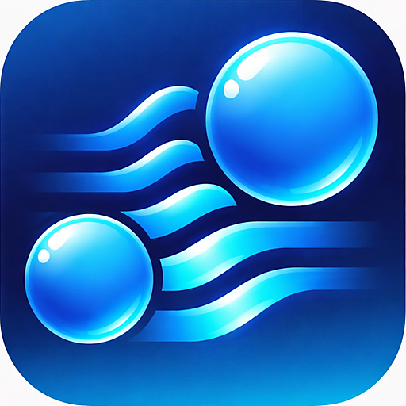

# Hablará App Icon

## TL;DR (20 words)

Neural Voice Wave Icon (Liquid Glass): 2 glänzende Kugeln + 3-4 dicke Wellen, macOS 26 Tahoe compliant, 32px-optimiert.

---

## Essential Context

> **DIATAXIS Category**: Reference (Information-oriented)
> **Audience**: Designer, Entwickler, die App-Icon verstehen oder modifizieren

**Zweck**: Dokumentation des finalen Hablará App Icons (Neural Voice Wave Konzept) mit Design-Rationale und technischen Specs.

**Scope**: Icon-Design, Symbolik, Farbcodes, Größen-Varianten, DALL-E Prompt-Referenz.

**Key Points**:
- **Konzept:** Neural Voice Wave (Liquid Glass - Simplified)
- **Optimierung:** 32px-optimiert (2 große Kugeln + dicke Wellen)
- **Compliance:** macOS 26 Tahoe Liquid Glass Guidelines

**Quick Access**:
- [Final Icon](#final-icon)
- [Design-Rationale](#design-rationale)
- [Farbcodes](#farbcodes)
- [Vollständiger Workflow](../docs/how-to/icon/CREATE_MACOS_APP_ICON.md)

---

## Final Icon



**Konzept:** Neural Voice Wave (Liquid Glass - Simplified)

---

## Design-Rationale

Nach intensivem Design-Prozess (siehe `concepts/README.md` für Archiv) wurde dieses vereinfachte Design gewählt, weil es:

1. **Perfekt für kleine Größen optimiert ist** - Nur 2 große Kugeln + 3-4 dicke Wellen
2. **Hablará's Kernthemen vereint** - Voice (Wellen) + AI Intelligence (Kugeln)
3. **macOS 26 Tahoe Liquid Glass compliant** - Gerundete Form füllt volle 1024x1024px
4. **Unique und professionell** - Nicht generisches Mikrofon, wissenschaftlich

### Symbolik

**Visuell:**
- **2 große glänzende Kugeln** (translucent, Liquid Glass Stil) - Molekulare Nodes
- **3-4 dicke Wellenlinien** (horizontal, Blau→Cyan Gradient) - Schallwellen

**Bedeutung:**
- **Wellenlinien** = Voice Input (Sprache, Audio-Aufnahme)
- **Kugeln** = AI Intelligence (neuronales Netzwerk, Verarbeitung)
- **Transformation** = Hablará's Kernversprechen: "Deine Sprache wird zu strukturierten Insights"

Das Icon visualisiert nicht "ein Mikrofon" (zu simpel) oder "ein Gehirn" (zu klinisch), sondern **die Transformation selbst** - von roher Sprache zu intelligentem Feedback.

---

## Farbcodes

| Farbe | Hex Code | Verwendung |
|-------|----------|------------|
| **Primär (Dunkelblau)** | `#2563eb` (Blue-600) | Vertrauen, Sicherheit, Privacy |
| **Akzent (Hellcyan)** | `#06b6d4` (Cyan-500) | Innovation, Moderne |
| **Gradient** | Horizontal links→rechts + Radial (Kugeln) | Dynamik, Transformation |

---

<details id="dalle-prompt-details">
<summary><b>DALL-E Prompt Details</b> - Vollständige Dokumentation (click to expand)</summary>

## DALL-E Prompt Details

**Vollständige Dokumentation:** `docs/how-to/icon/CREATE_MACOS_APP_ICON.md`

**Quick-Reference:** 32px-optimiertes Design mit 2 großen Kugeln + dicken Wellen.

**Key Design Constraints:**
- Nur 2 große Kugeln (statt 5-6 kleine)
- 3-4 dicke Wellenlinien (mindestens 8-10px breit)
- Liquid Glass Material (translucent, Refractions)
- Gerundete 1024x1024px Form (macOS 26 Tahoe)
- Blau→Cyan Gradient (Horizontal)

**Iteration History:**
- Siehe `concepts/README.md` für alle 10+ Design-Iterationen
- Final Design = Iteration 8 (Simplified Neural Voice Wave)

</details>

---

<details id="icon-groessen-specs">
<summary><b>Icon-Größen & Specs</b> - Technische Details (click to expand)</summary>

## Icon-Größen & Specs

### Verfügbare Größen

| Größe | Datei | Verwendung |
|-------|-------|------------|
| 16x16 | `16x16.png` | Dock (klein), Listen |
| 32x32 | `32x32.png`, `32x32@2x.png` | Dock (standard) |
| 128x128 | `128x128.png`, `128x128@2x.png` | Dock (groß), Finder |
| 256x256 | `256x256.png`, `256x256@2x.png` | Finder (groß) |
| 512x512 | `512x512.png`, `512x512@2x.png` | Retina Displays |
| Bundle | `icon.icns` | macOS App Bundle |

**Total:** 9 PNG-Dateien + 1 ICNS-Bundle

### Technische Specs

- **Resampling:** Lanczos (höchste Qualität)
- **Sharpening:** Angewandt auf alle Größen <128px
- **Format:** RGBA PNG (Transparenz)
- **Color Space:** sRGB
- **DPI:** 72 (macOS Standard)

### Generation-Workflow

**Siehe:** `docs/how-to/icon/CREATE_MACOS_APP_ICON.md` Abschnitt 4 (Icon-Export-Workflow)

**Quick Steps:**
1. DALL-E 3 generiert 1024x1024px PNG
2. Manual Refinement (optional)
3. `scripts-dev/mac/generate-icon-sizes.sh` generiert alle Groessen + ICNS
4. Tauri Integration (`tauri.conf.json`)

**Script-Verwendung:**
```bash
./scripts-dev/mac/generate-icon-sizes.sh          # Interaktiv
./scripts-dev/mac/generate-icon-sizes.sh --yes    # Auto .icns
./scripts-dev/mac/generate-icon-sizes.sh --help   # Hilfe anzeigen
```

</details>

---

## Cross-References

### Design Documentation
- **[CREATE_MACOS_APP_ICON.md](../docs/how-to/icon/CREATE_MACOS_APP_ICON.md)** - Vollständiger Icon-Design & Export Workflow
- **[concepts/README.md](./concepts/README.md)** - Design-Iteration Archiv (10+ Konzepte)

### Project Documentation
- **[CLAUDE.md](../CLAUDE.md)** - Projekt-Einstiegspunkt
- **[docs/reference/guidelines/CONFIG.md](../docs/reference/guidelines/CONFIG.md)** - Tauri Config (Icon-Integration)

### Related Files
- **[scripts-dev/mac/generate-icon-sizes.sh](../scripts-dev/mac/generate-icon-sizes.sh)** - Icon-Conversion Script (1024px → alle Groessen + ICNS, macOS only)
- `src-tauri/tauri.conf.json` - Icon-Pfad Configuration

---

**Version**: 1.0.0
**Created**: 28. Januar 2026
**Status**: Production Ready
